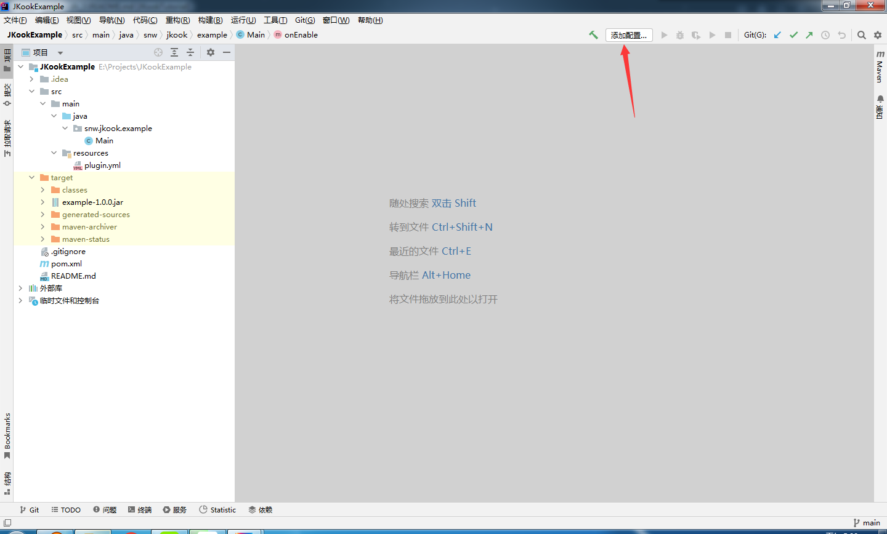
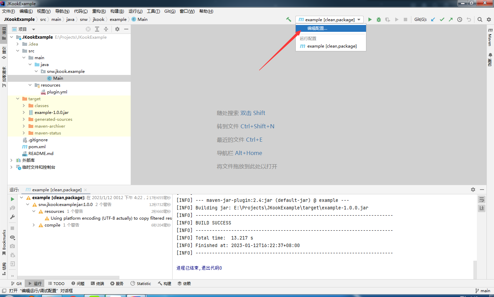
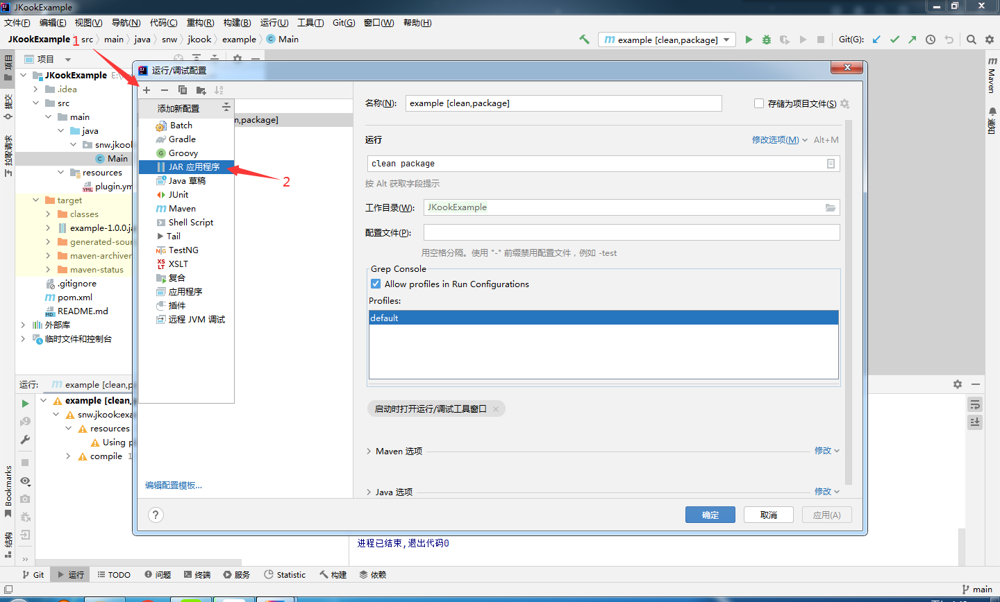
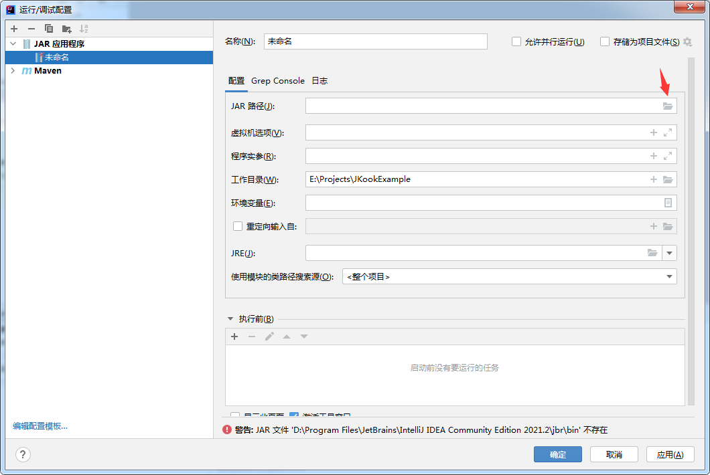
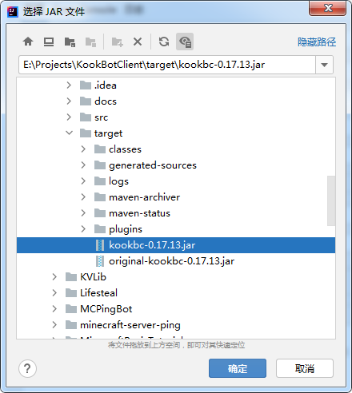
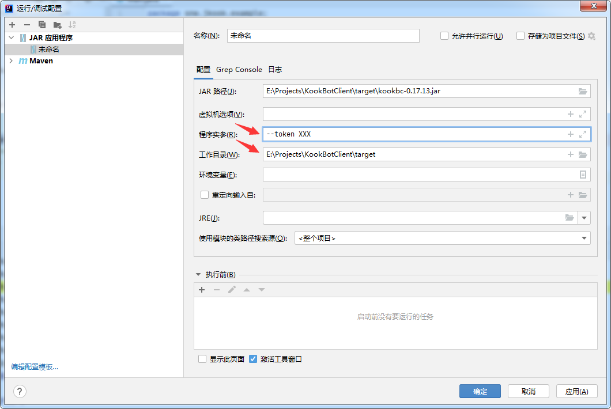
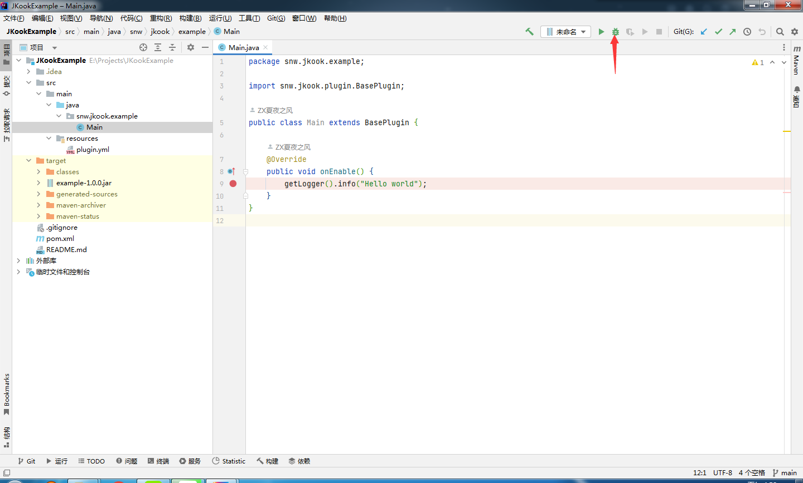
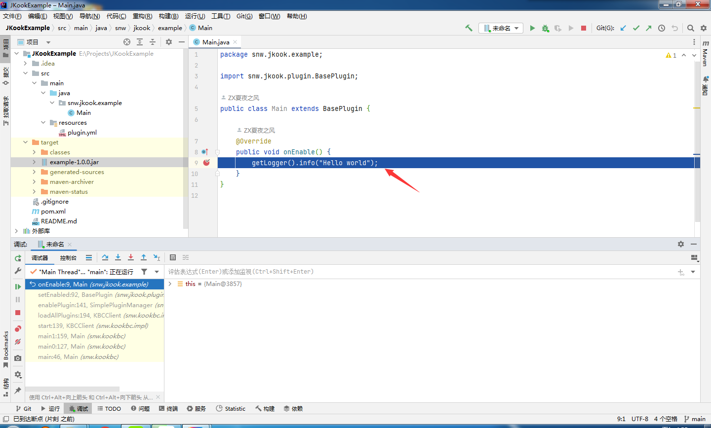

# Chapter 1

本章要讲的内容很简单，旨在告诉你一个简单的 JKook 插件如何声明，以及如何配置调试环境。

本章是对 [JKook Wiki - 插件格式规范](https://github.com/SNWCreations/JKook/wiki/Plugin-Format) 的更深入讲解，**示例代码有所不同**。

`code/src/main/resources/plugin.yml` 文件是插件元数据文件，用于描述插件详情。其结构详解可以在 JKook 插件格式规范 Wiki 页面 (链接见上文) 中找到，此处不再赘述。

---

请打开 `code/src/main/java/snw/jkook/example/Main.java` 文件。

---

从头看起，让我们看第 1 处。

`extends BasePlugin` 表明 Main 类继承 `BasePlugin` 类，而 `BasePlugin` 是 `Plugin` 接口类的一个可用实现。

**注意，plugin.yml 中指定的主类必须是 `Plugin` 类 (不绝对是 `BasePlugin` 类，因为其只是 `Plugin` 类的一种实现) 的子类，否则插件无效。**

---

再看第 2 处。

onLoad 方法在插件被加载后，启用前调用。

通过覆盖此方法即可在启用插件进行一些初始化操作，如释放默认配置。

**注意，默认配置若在 onEnable 阶段释放将无法被加载！**

相信你已经注意到了一些 `getLogger` 的调用。

这里顺带讲讲 JKook 的日志框架。

JKook 框架使用 [SLF4J](https://www.slf4j.org) 框架作为日志框架。

没听说过？没关系，这里简单讲讲。

SLF4J 提供了多种日志级别，以下列出常用的:

```text
ERROR - 错误 (影响了程序的正常运行)
WARN - 警告 (不影响程序的正常运行，但是可能会发生一点预期之外的事情)
INFO - 信息 (一般用于程序的正常运行过程中的重要事件)
DEBUG - 调试 (一般用于记录程序的正常运行过程中的细节)
```

严重程度依次递减。

`Plugin#getLogger` 方法返回 `org.slf4j.Logger` 的实例，即日志记录器。

使用以上日志级别记录日志，调用 `Logger` 中的对应方法即可。

日志方法的命名规范是全小写，如 `Logger#error` 方法对应 `ERROR` 等级。

---

现在，转到第 3 处。

若 onEnable 方法被调用，则意味着你的插件被启用了，在这个阶段，可以进行诸如加载配置，启动你的服务等操作。

**注意，若你的代码在以上两个阶段抛出异常，则插件将被禁用。**

但是，当你的插件真的出现了无法处理的异常，让你的插件被禁用无疑是最安全的。

---

最后，看第 4 处。

当 onDisable 方法被调用时，意味着你该关闭你的服务了。

在这个阶段，请关闭你的所有服务，清理不再使用的数据，保存需要持久化存储的数据。

**注意: onDisable 被调用并不意味着你的插件不会再被启用。有可能在一个 JVM 中，你的插件会被启用/禁用多次。_对插件的管理是由 `PluginManager` 接口实现的。_**

---

## 配置 KookBC 以用于调试

KookBC 是一个主要由 JKook API 作者 ZX夏夜之风 开发并维护的 JKook API 实现。

KookBC 提供了完整的 JKook API 功能实现。

请自行准备 Java 运行时环境(JRE，Java Runtime Environment)。一般情况下使用 Java 8 即可。

若插件使用了更高版本的 Java API ，则请准备插件所用的 Java 所对应的运行时环境。

若多个插件均使用了不同的 Java 版本，取其中的最高版本作为使用的 Java 运行时环境的版本。

对于开发者，请安装 JDK ，而不是仅安装 JRE 。JDK 中包含 JRE 。

Java 运行时环境可以在以下地址下载:
* [清华大学开源软件镜像站 - Eclipse Adoptium OpenJDK](https://mirror.tuna.tsinghua.edu.cn/Adoptium)

具体的安装过程此处不再赘述。

请打开 [KookBC Releases](https://github.com/SNWCreations/KookBC/releases) 页面，下载你需要的 KookBC 版本。

JKook API 0.37.x 对应 KookBC 0.17.x 。

JKook API 0.43.x 对应 KookBC 0.21.x 。

下载对应版本的最新版本，以保证得到最新的漏洞修补。

下载好后，在一个你认为合适的地方新建文件夹(路径尽量纯英文)，将 KookBC 放入。

接下来的部分可以参照 [KookBC 仓库主页](https://github.com/SNWCreations/KookBC) 的 README 操作。

### 使用 IntelliJ IDEA 调试你的插件

以下内容基于 IntelliJ IDEA 2022.1.4 版。

既然都有现代化的 IDE 用于开发了，为什么不用现代化的调试方法呢？

毕竟，工具用得好，事半功倍。

在开始以下内容前，请先准备一份 KookBC ，一个 KOOK 机器人 Token (不知道怎么获取? 读[这份教程](../Get_Bot_Token.md))。

首先，用 IDEA 打开你的插件项目，找到图中的 "添加配置" 并点击。



若你的项目已经有至少 1 个运行配置了，请看下图，找到图中的 "修改配置" 并点击。



新建一个类型为 "JAR 应用程序" 的运行配置。



配置 JAR 路径为 KookBC JAR 。





然后，配置 "程序实参" 和 "工作目录"。

工作目录可以随意，但这会影响你的 KookBC 数据所在位置 (如 plugins 文件夹和 kbc.yml 等数据会在工作目录创建)，一般情况下直接设置为 KookBC JAR 所在位置即可。

若你未配置 kbc.yml ，则可以在程序实参中通过 `--token` 命令行参数向 KookBC 传递你的 Token 。

更多的 KookBC 设置仍然需要看 kbc.yml 。



在 KookBC 完成配置后，以下内容就是你一般调试的流程了。

编译你的插件，将其放到调试用的 KookBC 的 plugins 文件夹。

然后在你的插件源代码中打上断点，接着以调试模式启动你的 KookBC 运行配置。

断点应该会正常工作。





---

至此，本章内容结束了。

本章我们了解了 JKook 插件的声明，以及调试环境的配置。

如果你准备好了，进入下一章吧！该聊聊命令系统了。
