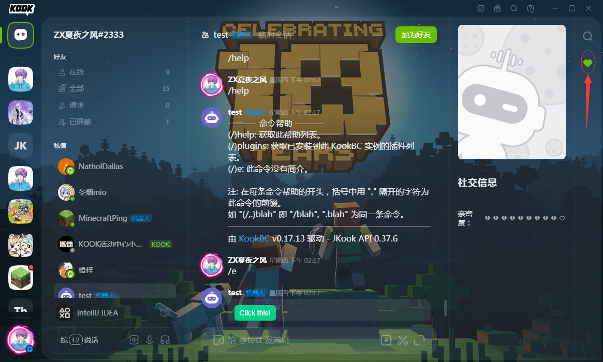
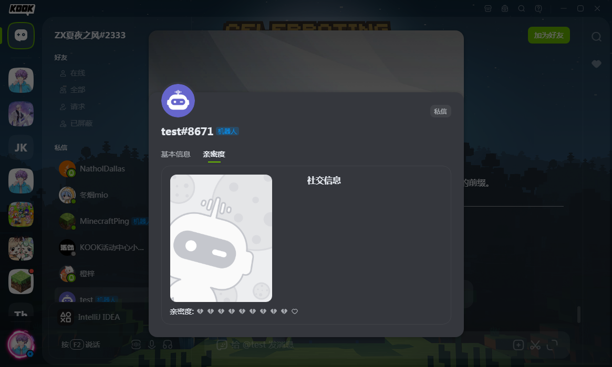
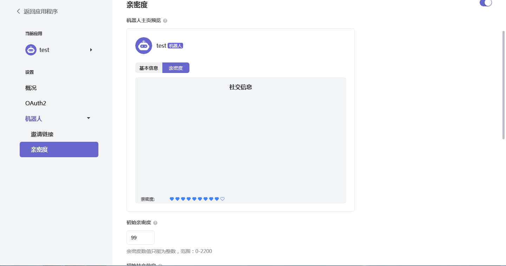
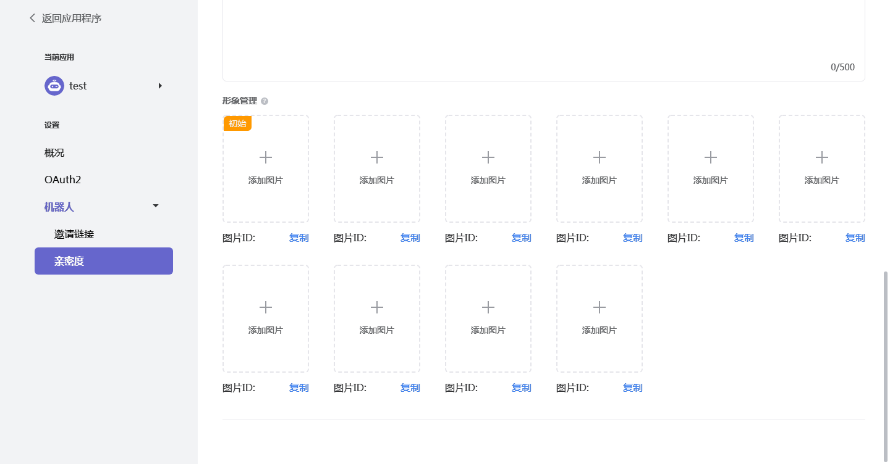

# Chapter 4

在了解了 JKook API 的插件系统后，本章我们讲讲实体体系。

实体 (英文 `Entity`) 一词借鉴于游戏 Minecraft ，这里表示一个可以产生交互的对象。

JKook API 将对于 KOOK 软件中的"实体"及其附属内容的抽象放在 `snw.jkook.entity` 包。
* 其实**用户发送的消息也算是一种实体**，但是在 API 早期开发阶段的时候，我们发现消息包中的 CardMessage 部分的包名过长(当时是诸如 `snw.jkook.entity.message.component.card.structure` 的名称)，故从实体包 `snw.jkook.entity` 移动到了根包 `snw.jkook` 。

---

先总览包结构。

```text
snw.jkook.entity
|   CustomEmoji
|   Game
|   Guild
|   Invitation
|   Reaction
|   Role
|   User
|   
+---abilities
|       Accessory
|       AccessoryHolder
|       AvatarHolder
|       InviteHolder
|       MasterHolder
|       Nameable
|       ReactionHolder
|       Receivable
|       
+---channel
|       Category
|       Channel
|       TextChannel
|       VoiceChannel
|       
\---mute
        MuteData
        MuteResult
```

`snw.jkook.entity.abilities` 包中的各种接口表示一个实体可以具有的能力。

`snw.jkook.entity.channel` 包提供了对服务器(`Guild`)中的各种频道的抽象。

`snw.jkook.entity.mute` 包是用于服务 `Guild#getMuteStatus` 方法的，其中的接口只是附属内容，本章不会讲解。

---

## 具体元素

先从一些大概念讲起。顺带讲讲其中一些有用的方法。

### User

完整限定名为 `snw.jkook.entity.User` 。

表示一个用户。
* 机器人也是一种用户。机器人的用户对象可以通过 `Core#getUser` 方法获得。

假设你现在有一个用户对象。

你可以通过 `User#getId` 方法获得这个用户的 KOOK ID ，用户的 KOOK ID 是唯一且不可变的。

通过 `User#getName` 方法可以获得这个用户的名称，它是可变的。用户在一个服务器没有昵称时，显示其名称。
* 普通用户 90 天可以修改一次名称，有 KOOK BUFF 的用户 10 天可以修改一次名称。
* KOOK 用户的完整名称格式是 `Name#IdentifyNumber` ，`User#getName` 方法仅能获得前半部分(即 `Name`)，若需要用户的完整名称，用表达式 `user.getName() + "#" + user.getIdentifyNumber()` 即可。

`User#isVip` 方法会告诉你这个用户是否正在享用 KOOK BUFF 权益。

获取一个用户在特定服务器的昵称，可以使用 `User#getNickName(Guild)` 方法。

更多的属性，诸如是否在线(`User#isOnline`)，是否被 KOOK 平台封禁(`User#isBanned`) 等均可通过此接口获得。

#### 私信

`User#sendPrivateMessage` 方法用于对此用户发送一条私信消息。

具体的用法将在下一章讲解。

#### 亲密度

本节专门讲解 KOOK 为机器人设计的用户亲密度系统。

> "机器人可以在应用后台配置默认的初始亲密度和形象。机器人可以根据一些逻辑来更新与该用户的亲密度，从而更新形象展示(注: 包含在社交信息中)。"
> 
> --- 摘自 KOOK 开发者文档，有修改

先上几张图片。



上图为机器人用户在私聊界面的社交信息按钮点击后展示的内容。



上图为机器人用户的个人信息页中的社交信息部分。





以上两张图片为机器人应用后台关于亲密度的设置页面。

修改用户亲密度的方法为 `User#setIntimacy` 。

亲密度的有效范围为 0 -- 2200 ，因此，若传递此范围以外的数字，方法将抛出异常。

> 正常亲密度是 0-2000 ，在 1000-2000 的范围中每 100 分为 1 颗红心，0-1000 是负分，显示灰色的裂心。
>
> --- 不鲲 (KOOK 员工)
> 
> 在 KOOK 官方开发者服务器 "问题反馈" 频道发送的消息，发送于 2020-12-14 下午 09:30，根据 KOOK 客户端现状进行了修改
> 
> 注: 虽然 KOOK 客户端将负分渲染为灰色的裂心，但从图 3 可以看出，应用后台遇到负分仍然是渲染为蓝心。

_~~也许你可以利用这个系统制作一个可以恋爱的机器人？？？？？哦，这个想法太怪了。~~_

### Guild

完整限定名为 `snw.jkook.entity.Guild` 。

表示一个服务器，是 KOOK 软件中用户交流与管理的主要渠道。

TODO
