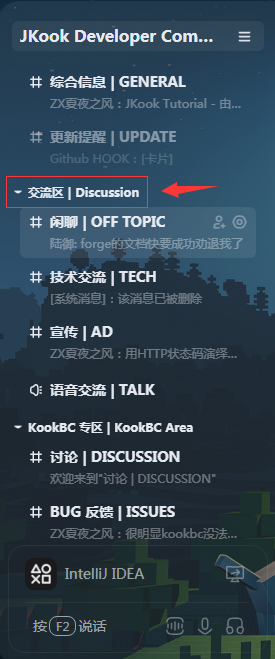
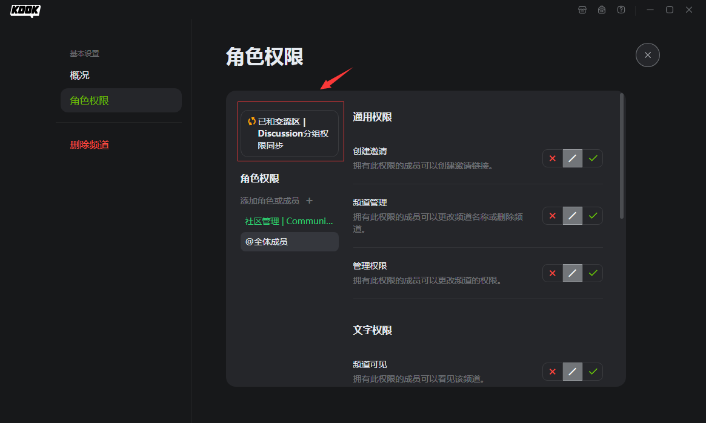
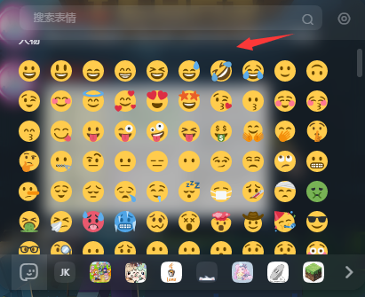
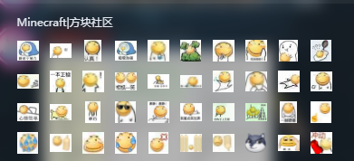
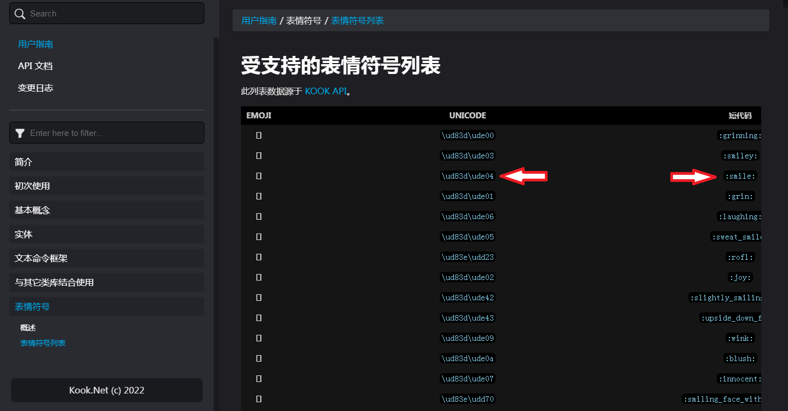

# Chapter 4

在了解了 JKook API 的插件系统后，本章我们讲讲实体体系。

实体 (英文 `Entity`) 一词借鉴于游戏 Minecraft ，这里表示一个可以产生交互的对象。

JKook API 将对于 KOOK 软件中的"实体"及其附属内容的抽象放在 `snw.jkook.entity` 包。
* 其实**用户发送的消息也算是一种实体**，但是在 API 早期开发阶段的时候，我们发现消息包中的 CardMessage 部分的包名过长(当时是诸如 `snw.jkook.entity.message.component.card.structure` 的名称)，故从实体包 `snw.jkook.entity` 移动到了根包 `snw.jkook` 。~~虽然还是很长，但聊胜于无。~~
* 消息体系将在下章讲解。

## 运行一次示例

先运行本章的示例代码。

本章示例代码有一个 /info 命令，试试在一个文字频道和私信里各执行一次？

效果是: 首先，机器人会在你发的命令消息上增加一个 "大笑" 的 Emoji ，然后告诉你一些诸如你的用户 ID ，完整用户名之类信息。

在阅读下文的过程中阅读示例代码，你将渐渐理解它。

## 总览包结构

先总览包结构。

```text
snw.jkook.entity
|   CustomEmoji
|   Game
|   Guild
|   Invitation
|   Reaction
|   Role
|   User
|   
+---abilities
|       Accessory
|       AccessoryHolder
|       AvatarHolder
|       InviteHolder
|       MasterHolder
|       Nameable
|       ReactionHolder
|       Receivable
|       
+---channel
|       Category
|       Channel
|       TextChannel
|       VoiceChannel
|       
\---mute
        MuteData
        MuteResult
```

`snw.jkook.entity.abilities` 包中的各种接口表示一个实体可以具有的能力。

`snw.jkook.entity.channel` 包提供了对服务器(`Guild`)中的各种频道的抽象。

`snw.jkook.entity.mute` 包是用于服务 `Guild#getMuteStatus` 方法的，其中的接口只是附属内容，本章不会讲解。

---

## 获取这些元素

你可以通过 `snw.jkook.HttpAPI` 接口获得 `User`，`Guild`，`Channel` 的实例。

更多的附属元素（如 `CustomEmoji`）可以这些元素中的一些方法获得。

你也可以通过一些事件获得这些元素。事件系统的使用我们将在后文讲解。

## 具体元素

### User

完整限定名为 `snw.jkook.entity.User` 。

表示一个用户。
* 机器人也是一种用户。机器人的用户对象可以通过 `Core#getUser` 方法获得。

假设你现在有一个用户对象。

你可以通过 `User#getId` 方法获得这个用户的 KOOK ID ，用户的 KOOK ID 是唯一且不可变的。

通过 `User#getName` 方法可以获得这个用户的名称，它是可变的。用户在一个服务器没有昵称时，显示其名称。
* 普通用户 90 天可以修改一次名称，有 KOOK BUFF 的用户 10 天可以修改一次名称。
* KOOK 用户的完整名称格式是 `Name#IdentifyNumber` ，`User#getName` 方法仅能获得前半部分(即 `Name`)，若需要用户的完整名称，用表达式 `user.getName() + "#" + user.getIdentifyNumber()` 即可。

`User#isVip` 方法会告诉你这个用户是否正在享用 KOOK BUFF 权益。

获取一个用户在特定服务器的昵称，可以使用 `User#getNickName(Guild)` 方法。

更多的属性，诸如是否在线(`User#isOnline`)，是否被 KOOK 平台封禁(`User#isBanned`) 等均可通过此接口获得。

#### 私信

`User#sendPrivateMessage` 方法用于对此用户发送一条私信消息。

具体的用法将在下一章讲解。

#### 亲密度

本节专门讲解 KOOK 为机器人设计的用户亲密度系统。

> "机器人可以在应用后台配置默认的初始亲密度和形象。机器人可以根据一些逻辑来更新与该用户的亲密度，从而更新形象展示(注: 包含在社交信息中)。"
> 
> --- 摘自 KOOK 开发者文档，有修改

先上几张图片。


上图为机器人用户在私聊界面的社交信息按钮点击后展示的内容。


上图为机器人用户的个人信息页中的社交信息部分。


以上两张图片为机器人应用后台关于亲密度的设置页面。

修改用户亲密度的方法为 `User#setIntimacy` 。

亲密度的有效范围为 0 -- 2200 ，因此，若传递此范围以外的数字，方法将抛出异常。

> 正常亲密度是 0-2000 ，在 1000-2000 的范围中每 100 分为 1 颗红心，0-1000 是负分，显示灰色的裂心。
>
> --- 不鲲 (KOOK 员工)
> 
> 在 KOOK 官方开发者服务器 "问题反馈" 频道发送的消息，发送于 2020-12-14 下午 09:30，根据 KOOK 客户端现状进行了修改
> 
> 注: 虽然 KOOK 客户端将负分渲染为灰色的裂心，但从图 3 可以看出，应用后台遇到负分仍然是渲染为蓝心。

_~~也许你可以利用这个系统制作一个可以培养好感度的机器人？？？？？哦，这个想法太怪了。~~_

#### 好友系统

感谢 [DeeChael](https://github.com/DeeChael) 发掘的好友系统 API 。

这部分 API 加入于 API 0.49.0 。

你的机器人可以和普通用户成为好友了！

相关方法放在 `HttpAPI` 中，但是因为这些方法与用户联系更为密切，所以我们放在这里来讲。

`HttpAPI#getFriendState` 方法可以让你获取当前机器人账号下的好友列表状态，它只是一个快照，这意味着当你需要最新数据时，你应该调用此方法重新请求数据。

`HttpAPI#addFriend` 方法可以让你向指定用户发出一个好友请求。

`HttpAPI#deleteFriend` 方法可以让你删除一个好友。

`HttpAPI#handleFriendRequest` 方法与 `HttpAPI.FriendRequest#handle` 效果一致，决定是否同意好友请求。

### Guild

完整限定名为 `snw.jkook.entity.Guild` 。

表示一个服务器，是 KOOK 软件中用户交流与管理的主要渠道。

#### Permission

完整限定名为 `snw.jkook.Permission` 。

对一个服务器进行一些操作会需要机器人拥有特定的权限。

> 权限是一个 unsigned int 值，由比特位代表是否拥有对应的权限。
> 
> 权限值与对应比特位进行按位与操作，判断是否拥有该权限。
> 
> --- [KOOK 开发者文档](https://developer.kookapp.cn/doc/http/guild-role)

而此枚举存放 KOOK 中各种服务器权限的值。

你会在对角色的操作时用到它们。

Tips: 有一个注解，叫 `snw.jkook.util.RequirePermission` ，它会和 `Permission` 的枚举对象一起出现在一些方法上，作用是提醒你这个方法需要特定权限。

判断权限？使用 `Permission.hasPermission` 方法，传入一个权限枚举对象和一个权限值总和即可。

那怎么计算权限值呢？

将多个权限的值 (值可以通过 Permission 对象的 getValue 方法获得) 相加，即为这几个权限的总和。

移除一个权限？先得到权限值总和，判断有无这个权限，如果有，将权限值综合与这个权限的值相减即可。

这里提供了一些工具代码:
```java
public static int sum(Permission... perms) {
    int sum = 0;
    for (Permission p : perms) {
        sum += p.getValue();
    }
    return sum;
}

public static int remove(int sum, Permission perm) {
    return Permission.hasPermission(perm, sum) ? sum - perm.getValue() : sum;
}
```

`sum` 方法为求多个权限的值之和。

`remove` 方法为从给定的权限值中移除指定权限。

(这些工具代码已经在最新的 API 0.49.0 里提供。)

#### Role

**对 `Role` 进行任何操作的前提是你的机器人在角色对应服务器中有角色管理的权限。**

完整限定名为 `snw.jkook.entity.Role` 。

表示一个服务器中的一个角色。可以为不同的角色配置不同的权限，以实现权限管理的功能。

可以通过 `User#grantRole` 和 `User#revokeRole` 方法实现用户角色的授予与剥夺。

在一个服务器中新建一个角色？调用 `Guild#createRole` 方法。

获取一个服务器已有的所有角色？调用 `Guild#getRoles` 方法。

你可以通过 `Role#isPermissionSet` 方法检查此角色是否有特定权限。

#### Invitation & InviteHolder

一个服务器里人太少了怎么办？邀请一些你的朋友！

这里讲解 JKook 对于 "邀请" 这一过程中的一些东西是如何抽象的。

首先，在 KOOK 中，邀请一个人到一个服务器/频道的方式是向 TA 发送邀请链接。

邀请链接不仅可以由用户创建，也可以由机器人创建。~~这简直是废话，毕竟机器人就是一种用户。~~

怎么创建邀请链接？这就要看 `InviteHolder` 了。

其完全限定名为 `snw.jkook.entity.abilities.InviteHolder` 。表示一个可以创建邀请链接的对象。

`Guild`，`NonCategoryChannel` 都是其子类。

其代码如下:

```java
public interface InviteHolder {

    PageIterator<Set<Invitation>> getInvitations();
    
    String createInvite(int validSeconds, int validTimes);
}
```

在这个接口下，我们能看见一个叫 `createInvite` 的方法。

在参数中，前者为有效时间（单位：秒），后者为邀请链接可以被使用的次数。

以下给出一些算好的有效时间的常量:
```text
0 => 永不
1800 => 0.5 小时
3600 => 1 个小时
21600 => 6 个小时
43200 => 12 个小时
86400 => 1 天
604800 => 7 天
```

以下给出一些邀请链接可用次数的常量:
```text
-1 => 无限制
1 => 1 次使用
5 => 5 次使用
10 => 10 次使用
25 => 25 次使用
50 => 50 次使用
100 => 100 次使用 
```

以上常量摘自 [KOOK 开发者文档](https://developer.kookapp.cn/doc/http/invite)。

此方法的返回结果是一个邀请链接的字符串，你可以通过这个制作一些诸如通过命令获取特定频道邀请链接的功能。~~（感觉好鸡肋啊）~~

获取为 `InviteHolder` 的实例创建的邀请信息，使用 `getInvitations` 方法。

什么？你想问 `PageIterator` 是什么？

那是我们对 KOOK HTTP API 中按分页格式设计的 API 的统一抽象。因为按分页格式设计的 API 不能一次得到所有数据，需要遍历，因此我们创建了 `PageIterator` 。

就当它是一个普通的 `Iterator` 用吧。

还不知道 `Iterator` 是什么？看看[这个](https://www.liaoxuefeng.com/wiki/1252599548343744/1265124784468736)？
* 此链接来自 廖雪峰的官方网站 ，感谢作者提供的优秀文章！

### Channel

完整限定名为 `snw.jkook.entity.channel.Channel` 。

表示一个频道。

获取一些常规属性的方法（如名称对应 `getName` 方法，ID 对应 `getId` 方法）这里就不多讲了。

~~`Channel#getParent` 方法可以获取频道的父分组频道对象。~~

~~有对应的 `Channel#setParent` 方法可以修改。~~

* 自 API 0.49.0 开始，因为 `Category` 不可能有父分组，所以将与父分组有关的方法移到了新接口 `NonCategoryChannel` 。
* 如果你需要调用相关方法，请自行向下转型。

#### Category

完整限定名为 `snw.jkook.entity.channel.Category` 。

表示一个分组。

分组是什么？



图中箭头所指的就是一个分组。

**关于分组有一个特性：对分组设置的[特定于频道的权限](#特定于频道的权限)会对其下属的所有频道生效。除非频道的权限不与分组同步。**



**另外注意，来自 `InviteHolder` 接口的方法以及 `Channel#getParent`、`Channel#setParent` 方法在 `Category` 接口中不可用，因为它不是 `NonCategoryChannel` 。**

#### NonCategoryChannel

完全限定名为 `snw.jkook.entity.channel.NonCategoryChannel` 。

加入于 API 0.49.0 。

表示一个"不是分组"的频道，设计它是为了将一些在 API 0.48 及以前对分组完全不可用的功能剥离出来。

是 `InviteHolder` 的子类，这意味着有关邀请链接的方法对此接口可用。

是 `ParentHolder` (`snw.jkook.entity.abilities.ParentHolder`) 的子类，这意味着与父分组有关的方法 (`getParent`, `setParent` 方法) 对此接口可用。

`TextChannel` 与 `VoiceChannel` 都是其子类。

#### TextChannel

完整限定名为 `snw.jkook.entity.channel.TextChannel` 。

表示一个文字频道。

获取一个文字频道中的历史消息可以使用 `TextChannel#getMessages` 方法。使用此方法建议配合阅读[KOOK 开发者文档 - 消息](https://developer.kookapp.cn/doc/http/message)中"获取频道聊天消息列表"一节。

对一个文字频道发送消息组件可以使用 `TextChannel#sendComponent` 方法。具体用法将在下章讲解。

#### VoiceChannel

完整限定名为 `snw.jkook.entity.channel.VoiceChannel` 。

表示一个语音频道。

`VoiceChannel#getUsers` 方法可以获取由所有已加入此语音频道的用户组成的列表。

`VoiceChannel#moveToHere` 方法可以将另一个语音频道中的用户移动到此语音频道。

`VoiceChannel#getMaxSize` 方法可以获取此语音频道最大可以容纳的用户数。

#### 特定于频道的权限

一个角色的权限适用于整个服务器的所有频道。

但是通过为特定频道给特定角色/用户设置权限，可以给这些被特别对待的角色/用户在特定的频道本没有的权限。

举个例子。

用户 A 有角色 B 。

有一个频道需要有角色 C 的用户才能访问。

但是管理员可以在这个频道上特别设置用户 A 的权限，使其可以访问这个频道。

再举一个例子。

有一个文字频道，所有人都不能在那里上传文件。

但是管理员可以特别让有角色 D 的用户可以在这里上传文件。

我们将这称之为特定于频道的权限。

在 `Channel` 接口中，有如下方法可以操作特定于频道的权限。

```java
public interface Channel {

    // ...

    void updatePermission(int roleId, int rawAllow, int rawDeny);

    void updatePermission(Role role, int rawAllow, int rawDeny);

    void updatePermission(User user, int rawAllow, int rawDeny);

    void deletePermission(Role role);

    void deletePermission(User user);

    // ...

}
```

前两个是对角色设置特定于频道的权限，第三个是对用户设置特定于频道的权限。

最后两个是删除频道上指定角色/用户的特定于频道的权限。

### CustomEmoji

完整限定名为 `snw.jkook.entity.CustomEmoji` 。

表示一个表情（也可以直接称作 Emoji）。

其 ID 可以通过 `CustomEmoji#getId` 方法获取。

它可以是:



这些由 KOOK 提供的自带 Emoji 。下文称之为 "KOOK 原生 Emoji"。

也可以是:



这种由服务器管理员上传的 Emoji 。

获取一个服务器的 Emoji 列表可以使用 `Guild#getCustomEmojis` 方法。

获取 KOOK 原生 Emoji 的方法如下。

到 [KOOK 原生 Emoji 列表 - Kook.Net 文档](https://kooknet.dev/guides/emoji/emoji-list.html) 查询你需要的 Emoji ，获得其 Unicode 码，然后使用 `snw.jkook.Unsafe#getCustomEmoji` 方法获得其具体实例。
* 如 `:smile:` 表情的 Unicode 码为 `\ud83d\ude04` 。



上图中，向左箭头指向的是 Unicode 码，向右箭头指向的是短代码，用于包含在 Markdown 消息组件中实现发送带 Emoji 的消息。

获取 KOOK 原生 Emoji 的大致代码如下:
```java
String emojiUnicode = "";
snw.jkook.Unsafe unsafe; // 具体获取 Unsafe 的代码已忽略。
                         // 如可以使用 JKook.getUnsafe()
                         // 高版本可以用 Plugin.getCore().getUnsafe()
snw.jkook.entity.CustomEmoji emoji = unsafe.getCustomEmoji(emojiUnicode);
```

`CustomEmoji` 一般配合 `MarkdownComponent`（Markdown 消息组件，下一章会讲），实现机器人发送服务器表情的功能。

也可以用于 `Message#sendReaction` 方法，将 Emoji 作为对消息的回应发出。

### Reaction

完整限定名为 `snw.jkook.entity.Reaction` 。

表示对消息的回应。

这个也会在下一章讲解。

---

至此，本章结束了。

了解 JKook API 的实体体系，是你编写 JKook 插件的关键。

请务必反复仔细阅读本章。
