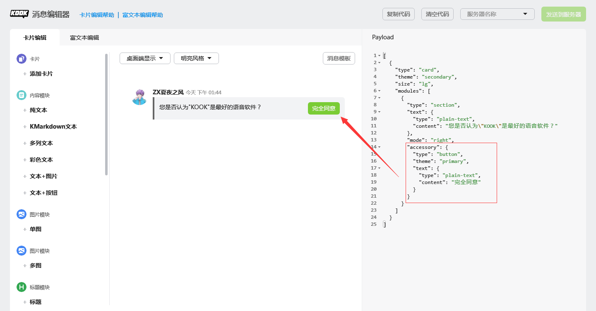
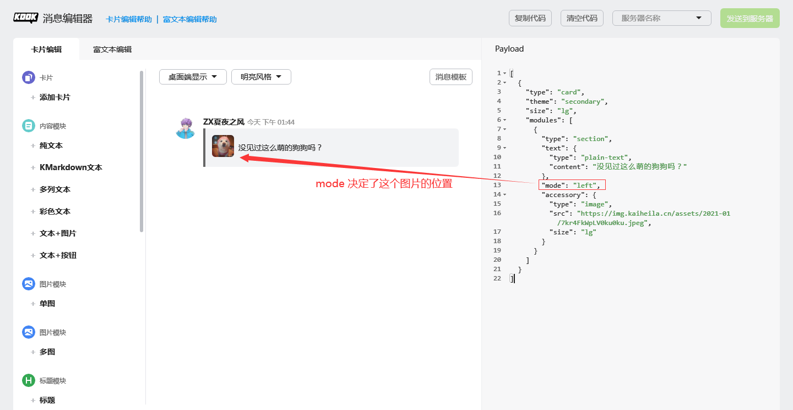
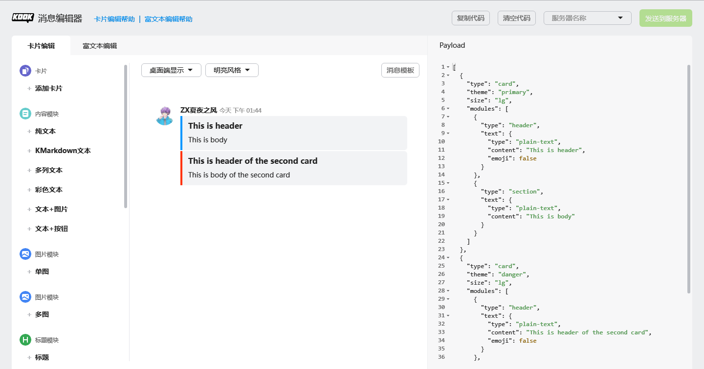

# Chapter 5

在你阅读上一章的时候，你应该注意到我们提了几次 `Message` ，那就是我们对 KOOK 消息的抽象接口。

本章，我们讲讲 JKook API 的消息体系。

## 运行一次示例

先运行本章的示例代码。

本章示例代码提供了两个命令，分别是 `/msginfo` 和 `/deleteme` 。

前者的效果是: 如果命令在文字频道中执行，会顺带提供频道 ID ，频道名称，频道所在服务器 ID ，频道所在服务器的名称。

后者的效果是: 如果命令在文字频道中执行，它会删除你发送的 `/deleteme` 消息。仅此而已。

在阅读下文的过程中阅读示例代码，你将渐渐理解它。
* _~~这句话好像在哪听过一次？~~_
* _~~是的，如果你读过上一章，你会发现本节与上一章关于示例代码的介绍出奇地像，因为我是照抄的。~~_

## 消息概述

消息是由 KOOK 用户发送的，包含了一些内容的实体。

**消息是一种实体。**
没有放在 `snw.jkook.entity` 包的原因在上一章已经讲过了。

JKook API 消息体系中的各种类基本统一放在 `snw.jkook.message` 包下。

## 总览包结构

先总览包结构。

```text
snw.jkook.message
|   Message
|   PrivateMessage
|   TextChannelMessage
|   
\---component
    |   BaseComponent
    |   FileComponent
    |   MarkdownComponent
    |   TextComponent
    |   
    \---card
        |   CardBuilder
        |   CardComponent
        |   CardScopeElement
        |   MultipleCardComponent
        |   Size
        |   Theme
        |   
        +---element
        |       BaseElement
        |       ButtonElement
        |       ImageElement
        |       InteractElement
        |       MarkdownElement
        |       PlainTextElement
        |       
        +---module
        |       ActionGroupModule
        |       BaseModule
        |       ContainerModule
        |       ContextModule
        |       CountdownModule
        |       DividerModule
        |       FileModule
        |       HeaderModule
        |       ImageGroupModule
        |       InviteModule
        |       package-info
        |       SectionModule
        |       
        \---structure
                BaseStructure
                Paragraph
```

根据以上结构，本章我们分为三大部分：

消息对象，消息组件，CardMessage（卡片消息）。

## 获取消息对象

最常见的方法是通过 `ChannelMessageEvent`（用户在文字频道发送消息的事件）或 `PrivateMessageReceivedEvent`（用户给自己发送私信的事件）的 `getMessage` 方法获得消息对象。
* 事件系统将在第 7 章讲解。

或者通过命令系统，`CommandExecutor` 和 `UserCommandExecutor` 接口的 `onCommand` 方法均提供了 `Message` 对象，表示导致命令被执行的消息对象。

## 消息对象

消息对象目前有两种：`TextChannelMessage` 和 `PrivateMessage` 。它们有一个共同的父类是 `Message` 接口。

### Message

完整限定名为 `snw.jkook.message.Message` 。

作为对一个消息的基本抽象，此接口可以获取的内容比较多。其子类主要是提供一些功能扩展。

通过 `Message#getId` 方法可以获得此消息的 ID 。

消息 ID 是一个 UUID 。

通过 `Message#getSender` 方法可以获得此消息的发送者。

通过 `Message#getTimeStamp` 方法可以获得此消息被发送时的时间戳。

通过 `Message#getComponent` 方法可以获得此消息包含的消息组件。通过消息组件对象，你可以得知用户发送的内容。消息组件相关内容将在下文讲解。

更新一条消息的内容可以使用 `Message#setComponent` 方法，但只支持更新 KMarkdown 消息以及卡片消息。
**只能更新机器人自己发出的消息。**

删除一条消息可以使用 `Message#delete` 方法。在私信中只能删除自己的消息，在文字频道中删除其他人的消息需要自己有消息管理权限。

在一条消息被删除后，对其对应的消息对象进行更新等操作将失败，因此，已被删除的消息的消息对象不再具有可用性。

`TextChannelMessage` 主要提供了更多的功能，如向频道发送一个临时消息的快捷封装，以及获取消息所在的文字频道。

## 消息组件

消息组件（英文 `Component`）一词同样借鉴于游戏 Minecraft ，用于存放消息的内容。
* _为什么实体和消息组件的名称都借鉴于 Minecraft ？因为 JKook 的作者就是个 Minecraft 玩家。_

JKook API 中的消息组件全部放在了 `snw.jkook.message.component` 包下。

`BaseComponent` 为消息组件的顶级父类。

`TextComponent` 为纯文本消息组件。
* **KOOK 官方已经弃用纯文本消息。** 所有的纯文本消息会在 KOOK 的服务端转换为 Markdown 之后再发送。

`MarkdownComponent` 为 Markdown 消息组件。继承自 `TextComponent` 类。

`FileComponent` 表示一个文件消息组件。

`FileComponent` 类下提供了一个 `Type` 枚举，表明文件的类型，支持 `AUDIO`（音乐），`VIDEO`（视频），`IMAGE`（图片），`FILE`（普通文件）。

你可以根据文件的类型，在构造它的时候指定类型。不同的类型在 KOOK 客户端中渲染的效果不一样。

**发送音乐文件时更推荐使用卡片消息中的 `FileModule` ，可以指定封面图片。**

## 发送消息

通常地，向一个文字频道发送一个消息组件只需要使用 `TextChannel#sendComponent` 方法即可。

向一个用户的私信发送一个消息组件？使用 `User#sendPrivateMessage` 方法即可。

### 回复消息

回复消息有两种方式。

1. 获取消息的来源（在私信中指用户，在文字频道中就是文字频道本身），然后调用相应的发送消息的方法
2. 直接使用 `Message#reply` 。

使用第一个方法可以这么写:
```java
BaseComponent component;
Message message;
if (message instanceof TextChannelMessage) {
    ((TextChannelMessage) message).getChannel().sendComponent(component, message, null);    
} else {
    message.getSender().sendPrivateMessage(component, message);
}
```

但这种方法如果想要大量使用必须封装，否则会造成很多重复代码。

但是，第二个方法是由 API 直接提供封装。

只需要一行代码:
```java
message.reply(component);
```

### 发送消息到消息来源

如果你不想要那个回复的框框...


对，就是红框里的那个。
_~~请不要在意内容。~~_

你可以使用另一个由 `Message` 提供的便利方法: `Message#sendToSource` 。

只需要一行代码:
```java
message.sendToSource(component);
```

### 临时消息

这是一个神奇的东西。

一个临时消息具有如下特性：
* 只能出现在文字频道中
* 仅有指定的用户可以看见
* 临时消息会在指定的用户在重启 TA 的 KOOK 客户端后消失
* 不可更新

因为第一条特性，发送一个临时消息需要将 `Message` 对象转为 `TextChannelMessage` 对象，然后再调用相关方法。
* 请务必先对消息对象进行 `instanceof` 检查。 **永远不要做未经检查的向下转换。**

我们支持回复消息的同时把消息作为临时消息，也支持直接发送到消息来源的同时设置为临时消息。

对于前者的情况，使用 `TextChannelMessage#replyTemp` 方法，对于后者的情况，使用 `TextChannelMessage#sendToSourceTemp` 方法。

## CardMessage

> 卡片消息是一种结构化的消息，提供了一种易用、统一的富交互形式。
> 
> --- KOOK 开发者文档，有修改

在阅读本节前，建议先阅读 KOOK 开发者文档中对于 [CardMessage](https://developer.kookapp.cn/doc/cardmessage) 的介绍，然后体验一下 KOOK 的 [卡片消息编辑器](https://kookapp.cn/tools/message-builder.html#/card) 。

卡片消息有如下特性:
* 美观
* 提供按钮作为新的交互形式
* 一条卡片消息中可以存放 5 张卡片，一条卡片消息中最多可以有 50 个模块（Module）。 **"卡片消息"在这里不可和"卡片"混为一谈。**

JKook API 中关于 CardMessage 的内容放在了 `snw.jkook.message.component.card` 包下。

这里先讲解几个重要的类： `CardComponent`，`MultipleCardComponent`，`Theme`，`Size` 以及 `CardBuilder` 。

`CardComponent` 表示单个卡片。

`MultipleCardComponent` 是一个可存放最多 5 张卡片的容器组件。

`Theme` 枚举列出了 KOOK 支持的几种 "风格" ，它可以影响卡片本身以及特定元素的颜色。

`Size` 枚举存放了 Bootstrap 中的 4 种栅格布局。
* 卡片本身仅支持 `LG` 与 `SM` 。剩余的是为卡片模块准备的。
* 卡片本身在移动端 KOOK 只会使用 `SM` 大小。
* Bootstrap 是前端框架，不在本教程范围中，只是 KOOK 用到了，故此处不作详细讲解。

`CardBuilder` 是一个基于建造者模式设计的卡片构造工具类。

### 各种元素

所有可以组成卡片的元素的顶级父类为 `CardScopeElement` ，位于 `snw.jkook.message.component.card` 包。

根据 KOOK 开发者文档，我们将组成卡片的各种元素分为了 `Element` （基础元素），`Module` （模块），`Structure` （结构体）。

本节不再详细讲解元素的结构，各种元素类均是按照 KOOK 开发者文档封装的，阅读 KOOK 开发者文档即可。

#### Accessory

其完整限定名为 `snw.jkook.entity.abilities.Accessory` 。

`Accessory` 表示一种可以嵌入进其他卡片元素的元素。

如 `ButtonElement` 即为一种 `Accessory` 。

举两个例子:





可以嵌入其他卡片元素的元素为 `AccessoryHolder` ，目前只有 `SectionModule` 是其子类。

### CardBuilder

本节讲解 `CardBuilder` 的基本用法。

在 `CardBuilder` 类的源代码中，我们已经提供了一个小例子，它的源代码如下（有稍作改动）:

```java
MultipleCardComponent card = new CardBuilder()
     .setTheme(Theme.PRIMARY)
     .setSize(Size.LG)
     .addModule(new HeaderModule(new PlainTextElement("This is header", false)))
     .addModule(new SectionModule(new PlainTextElement("This is body"), null, null))
     .newCard()
     .setTheme(Theme.DANGER)
     .setSize(Size.LG)
     .addModule(new HeaderModule(new PlainTextElement("This is header of the second card", false)))
     .addModule(new SectionModule(new PlainTextElement("This is body of the second card"), null, null))
     .build();
```

这个示例在 KOOK 消息编辑器中的渲染效果为下图:


